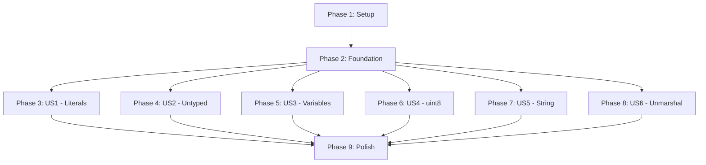

# Implementation Tasks: Enum Type Safety Linter

**Feature**: 001-enum-linter | **Branch**: `001-enum-linter` | **Spec**: [spec.md](./spec.md) | **Plan**: [plan.md](./plan.md)

## Overview

This document provides a comprehensive, dependency-ordered task breakdown for implementing the Go quasi-enum type safety linter. Tasks are organized by user story to enable independent implementation and testing.

**Total Functional Requirements**: 137  
**User Stories**: 6 (US1-US6)  
**Estimated Duration**: 14-20 days  
**MVP Scope**: User Story 1 (Detect Literal Assignment)

## Task Summary

| Phase | Description | Task Count | Est. Days |
|-------|-------------|------------|-----------|
| Phase 1 | Setup & Infrastructure | 8 | 2-3 |
| Phase 2 | Foundational Components | 12 | 3-4 |
| Phase 3 | US1: Literal Assignment Detection | 15 | 3-4 |
| Phase 4 | US2: Untyped Constant Detection | 6 | 1-2 |
| Phase 5 | US3: Variable Conversion Detection | 6 | 1-2 |
| Phase 6 | US4: uint8 Optimization | 5 | 1 |
| Phase 7 | US5: String() Method Check | 4 | 0.5 |
| Phase 8 | US6: UnmarshalText() Check | 4 | 0.5 |
| Phase 9 | Polish & Integration | 8 | 2 |
| **TOTAL** | | **68** | **14-20** |

## Dependencies & Execution Strategy

### User Story Dependencies



**Key Insights**:
- **MVP**: Phase 1 + Phase 2 + Phase 3 (US1) delivers core value
- **Parallel Opportunities**: US1-US6 can be implemented in parallel after Phase 2
- **Independent Testing**: Each user story is independently testable

### Parallel Execution Examples

**After Phase 2 (Foundation Complete)**:
```bash
# Team Member 1: Implements US1 (core violation detection)
# Team Member 2: Implements US4 (uint8 optimization)
# Team Member 3: Implements US5 + US6 (helper method checks)
```

**Within Phase 3 (US1)**:
```bash
# Multiple developers can work on different violation types simultaneously
# T021 [P] - Literal assignment detection
# T022 [P] - Literal argument detection  
# T023 [P] - Type conversion detection
# All work on different code paths, no conflicts
```

---

## Phase 1: Setup & Infrastructure

**Goal**: Establish project structure, dependencies, and core analyzer framework.

**Duration**: 2-3 days

**Independent Test**: Can run `go build` successfully and analyzer loads without errors.

### Tasks

- [ ] T001 Initialize Go module and project structure per plan.md
- [ ] T002 Add dependencies: `golang.org/x/tools/go/analysis`, `golang.org/x/tools/go/analysis/passes/inspect`, `golang.org/x/tools/go/analysis/analysistest`
- [ ] T003 Create directory structure: `cmd/enumsafety/`, `internal/analyzer/`, `internal/testdata/src/`
- [ ] T004 Implement main CLI entry point in `cmd/enumsafety/main.go`
- [ ] T005 [P] Create analyzer skeleton in `internal/analyzer/analyzer.go` with flag registration (14 flags per FR-044)
- [ ] T006 [P] Implement QuasiEnumType data structure in `internal/analyzer/enum.go` per data-model.md
- [ ] T007 [P] Implement Violation data structure in `internal/analyzer/violation.go` per data-model.md
- [ ] T008 Set up test infrastructure with `analysistest` framework in `tests/unit/analyzer_test.go`

**Completion Criteria**:
- ✅ Project builds without errors
- ✅ Analyzer loads and registers all 14 flags
- ✅ Test framework can run (even with empty tests)
- ✅ All data structures compile

---

## Phase 2: Foundational Components (BLOCKING)

**Goal**: Implement detection techniques and constraint validation that all user stories depend on.

**Duration**: 3-4 days

**Independent Test**: Can detect quasi-enum types and validate constraints independently of usage checks.

**CRITICAL**: This phase MUST complete before any user story implementation begins.

### Detection Techniques (DT-001 to DT-005)

- [ ] T009 [P] Implement DT-002 (name suffix detection) in `internal/analyzer/detection.go` per FR-002
- [ ] T010 [P] Implement DT-003 (inline comment detection) in `internal/analyzer/detection.go` per FR-003, FR-072, FR-073
- [ ] T011 [P] Implement DT-004 (preceding comment detection) in `internal/analyzer/detection.go` per FR-004
- [ ] T012 [P] Implement DT-005 (named comment detection) in `internal/analyzer/detection.go` per FR-005
- [ ] T013 Implement DT-001 (constants-based detection) in `internal/analyzer/detection.go` per FR-001, FR-079, FR-080
- [ ] T014 [P] Implement opt-out mechanism (`// not enum`) in `internal/analyzer/detection.go` per FR-046, FR-074, FR-075
- [ ] T015 Implement detection orchestration with performance optimization (explicit first) per FR-048

### Constraint Validation (DC-001 to DC-005)

- [ ] T016 [P] Implement DC-001 (minimum 2 constants) in `internal/analyzer/constraints.go` per FR-008, FR-122
- [ ] T017 [P] Implement DC-002 (same const block) in `internal/analyzer/constraints.go` per FR-009, FR-083, FR-084, FR-088
- [ ] T018 [P] Implement DC-003 (same file) in `internal/analyzer/constraints.go` per FR-010, FR-081, FR-090
- [ ] T019 [P] Implement DC-004 (exclusive block) in `internal/analyzer/constraints.go` per FR-011, FR-085
- [ ] T020 [P] Implement DC-005 (proximity) in `internal/analyzer/constraints.go` per FR-012, FR-086, FR-087, FR-089

**Completion Criteria**:
- ✅ All 5 detection techniques work independently
- ✅ All 5 constraints validate correctly
- ✅ Opt-out mechanism prevents detection
- ✅ Performance optimization (explicit first) implemented
- ✅ Unit tests pass for all detection and constraint logic

---

## Phase 3: User Story 1 - Detect Literal Assignment (P1) 🎯 MVP

**Goal**: Implement core violation detection for literal assignments to quasi-enum types.

**Duration**: 3-4 days

**Independent Test**: Create enum type, assign literal value, verify linter reports error. This is the MVP deliverable.

**Priority**: P1 - **HIGHEST** - Core value proposition of the linter.

### Implementation Tasks

- [ ] T021 [P] [US1] Implement literal assignment detection (FR-015) in `internal/analyzer/usage.go`
- [ ] T022 [P] [US1] Implement literal argument detection (FR-016) in `internal/analyzer/usage.go`
- [ ] T023 [P] [US1] Implement type conversion detection (FR-017) in `internal/analyzer/usage.go`
- [ ] T024 [P] [US1] Implement composite literal detection (FR-021, FR-102, FR-103) in `internal/analyzer/usage.go`
- [ ] T025 [P] [US1] Implement control flow literal detection (switch/if/for) (FR-104, FR-105, FR-106) in `internal/analyzer/usage.go`
- [ ] T026 [US1] Implement nested violation handling (report innermost first) per FR-049, FR-092, FR-093
- [ ] T027 [US1] Implement zero value validation (FR-094, FR-095) in `internal/analyzer/usage.go`
- [ ] T028 [US1] Implement type conversion restrictions (FR-098, FR-099, FR-100, FR-101) in `internal/analyzer/usage.go`
- [ ] T029 [US1] Implement multiple violation reporting (FR-051, FR-123, FR-124) in `internal/analyzer/violation.go`
- [ ] T030 [US1] Implement error message formatting per FR-024 in `internal/analyzer/violation.go`

### Test Tasks

- [ ] T031 [P] [US1] Create test fixtures in `internal/testdata/src/a/violations_us1.go` for all US1 scenarios
- [ ] T032 [P] [US1] Write unit tests for literal assignment detection in `tests/unit/analyzer_test.go`
- [ ] T033 [P] [US1] Write unit tests for literal arguments in `tests/unit/analyzer_test.go`
- [ ] T034 [P] [US1] Write unit tests for type conversions in `tests/unit/analyzer_test.go`
- [ ] T035 [US1] Write integration test for US1 acceptance scenarios in `tests/unit/analyzer_test.go`

**Completion Criteria**:
- ✅ All US1 acceptance scenarios pass
- ✅ Linter detects all literal assignment patterns
- ✅ Error messages are clear and actionable
- ✅ Zero value handling works correctly
- ✅ Nested violations report innermost first
- ✅ **MVP DELIVERABLE**: Core linter functionality complete

---

## Phase 4: User Story 2 - Detect Untyped Constant Assignment (P2)

**Goal**: Extend violation detection to catch untyped constants that aren't part of enum definition.

**Duration**: 1-2 days

**Independent Test**: Create enum, define external untyped constant, attempt assignment, verify error.

**Priority**: P2 - Important for completeness after core literal detection.

### Implementation Tasks

- [ ] T036 [P] [US2] Implement untyped constant detection (FR-019) in `internal/analyzer/usage.go`
- [ ] T037 [US2] Extend violation reporting to distinguish untyped constants from literals in `internal/analyzer/violation.go`

### Test Tasks

- [ ] T038 [P] [US2] Create test fixtures in `internal/testdata/src/a/violations_us2.go` for US2 scenarios
- [ ] T039 [P] [US2] Write unit tests for untyped constant detection in `tests/unit/analyzer_test.go`
- [ ] T040 [P] [US2] Write unit tests for typed constant validation in `tests/unit/analyzer_test.go`
- [ ] T041 [US2] Write integration test for US2 acceptance scenarios in `tests/unit/analyzer_test.go`

**Completion Criteria**:
- ✅ All US2 acceptance scenarios pass
- ✅ Untyped constants are correctly identified
- ✅ Typed enum constants are allowed
- ✅ Error messages distinguish untyped from literal violations

---

## Phase 5: User Story 3 - Detect Variable Conversion (P3)

**Goal**: Catch variable-based type conversions that bypass enum safety.

**Duration**: 1-2 days

**Independent Test**: Create enum, create variable of underlying type, attempt conversion, verify error.

**Priority**: P3 - Less common but important for complete type safety.

### Implementation Tasks

- [ ] T042 [P] [US3] Implement variable conversion detection (FR-020) in `internal/analyzer/usage.go`
- [ ] T043 [US3] Extend cross-enum conversion detection (FR-098) in `internal/analyzer/usage.go`

### Test Tasks

- [ ] T044 [P] [US3] Create test fixtures in `internal/testdata/src/a/violations_us3.go` for US3 scenarios
- [ ] T045 [P] [US3] Write unit tests for variable conversion detection in `tests/unit/analyzer_test.go`
- [ ] T046 [P] [US3] Write unit tests for cross-enum conversion in `tests/unit/analyzer_test.go`
- [ ] T047 [US3] Write integration test for US3 acceptance scenarios in `tests/unit/analyzer_test.go`

**Completion Criteria**:
- ✅ All US3 acceptance scenarios pass
- ✅ Variable conversions are detected
- ✅ Cross-enum conversions are blocked
- ✅ Type assertion handling works correctly (FROM ok, TO not ok per FR-100)

---

## Phase 6: User Story 4 - uint8 Optimization Suggestion (P4)

**Goal**: Provide helpful uint8 optimization suggestions with autofix capability.

**Duration**: 1 day

**Independent Test**: Create enum with int base type and <256 constants, verify suggestion appears.

**Priority**: P4 - Quality-of-life feature, not critical for correctness.

### Implementation Tasks

- [ ] T048 [P] [US4] Implement uint8 suggestion logic (FR-027, FR-114, FR-115, FR-116) in `internal/analyzer/optimization.go`
- [ ] T049 [P] [US4] Implement autofix capability (FR-028) in `internal/analyzer/optimization.go`
- [ ] T050 [US4] Integrate with flag `-disable-uint8-suggestion` (FR-029) in `internal/analyzer/analyzer.go`

### Test Tasks

- [ ] T051 [P] [US4] Create test fixtures in `internal/testdata/src/optimization/` for US4 scenarios
- [ ] T052 [US4] Write unit tests for uint8 suggestion logic including edge cases (256 constants, int8, negatives) in `tests/unit/analyzer_test.go`

**Completion Criteria**:
- ✅ All US4 acceptance scenarios pass
- ✅ Suggestion appears for int/uint with <256 constants
- ✅ Suggestion appears for int8 with non-negative values
- ✅ Suggestion does NOT appear for negative values
- ✅ Suggestion works even at 256 constants (0-255 fits in uint8)
- ✅ Autofix capability works
- ✅ Flag disables suggestion

---

## Phase 7: User Story 5 - String() Method Warning (P4)

**Goal**: Warn when quasi-enum types lack String() method for debugging.

**Duration**: 0.5 days

**Independent Test**: Create enum without String() method, verify warning appears.

**Priority**: P4 - Quality-of-life feature for better debugging experience.

### Implementation Tasks

- [ ] T053 [P] [US5] Implement String() method detection (FR-030, FR-117, FR-119) in `internal/analyzer/helpers.go`
- [ ] T054 [US5] Integrate with flag `-disable-string-method-check` (FR-032) in `internal/analyzer/analyzer.go`

### Test Tasks

- [ ] T055 [P] [US5] Create test fixtures in `internal/testdata/src/helpers/` for US5 scenarios
- [ ] T056 [US5] Write unit tests for String() method detection including non-standard signatures and pointer receivers in `tests/unit/analyzer_test.go`

**Completion Criteria**:
- ✅ All US5 acceptance scenarios pass
- ✅ Warning appears for missing String() method
- ✅ Warning appears for non-standard signature
- ✅ Pointer receiver String() is ignored
- ✅ Suggestion includes stringer tool references
- ✅ Flag disables warning

---

## Phase 8: User Story 6 - UnmarshalText() Method Warning (P4)

**Goal**: Warn when quasi-enum types lack UnmarshalText() for JSON/config parsing.

**Duration**: 0.5 days

**Independent Test**: Create enum without UnmarshalText() method, verify warning appears.

**Priority**: P4 - Quality-of-life feature for serialization support.

### Implementation Tasks

- [ ] T057 [P] [US6] Implement UnmarshalText() method detection (FR-033, FR-118) in `internal/analyzer/helpers.go`
- [ ] T058 [US6] Integrate with flag `-disable-unmarshal-method-check` (FR-035) in `internal/analyzer/analyzer.go`

### Test Tasks

- [ ] T059 [P] [US6] Create test fixtures in `internal/testdata/src/helpers/` for US6 scenarios
- [ ] T060 [US6] Write unit tests for UnmarshalText() method detection including non-standard signatures in `tests/unit/analyzer_test.go`

**Completion Criteria**:
- ✅ All US6 acceptance scenarios pass
- ✅ Warning appears for missing UnmarshalText() method
- ✅ Warning appears for non-standard signature
- ✅ Suggestion includes go-silly-enum reference
- ✅ Flag disables warning

---

## Phase 9: Polish & Integration

**Goal**: Finalize integration, documentation, and cross-cutting concerns.

**Duration**: 2 days

**Independent Test**: Can install via `go install`, run via `go vet`, all flags work correctly.

### Integration Tasks

- [ ] T061 Implement custom enum keyword support (FR-070, FR-131) in `internal/analyzer/analyzer.go`
- [ ] T062 Verify go vet integration per FR-026 and SC-014
- [ ] T063 Implement performance optimizations to meet <100ms target for <1000 lines per SC-012
- [ ] T064 Add comprehensive error handling per FR-052 to FR-113

### Documentation Tasks

- [ ] T065 [P] Create README.md with installation and usage instructions
- [ ] T066 [P] Create CONTRIBUTING.md with development guidelines
- [ ] T067 [P] Update quickstart.md with final examples and all 14 flags documented

### Validation Tasks

- [ ] T068 Run full test suite and verify >80% coverage per constitution
- [ ] T069 Validate all 137 functional requirements are implemented
- [ ] T070 Verify all 6 user stories pass acceptance criteria
- [ ] T071 Performance testing: verify <100ms for <1000 lines, <1s for typical packages
- [ ] T072 Integration testing: verify works with real Go projects

**Completion Criteria**:
- ✅ All 137 functional requirements implemented
- ✅ All 6 user stories pass acceptance tests
- ✅ Performance targets met
- ✅ Documentation complete
- ✅ go vet integration works
- ✅ All 14 configuration flags functional
- ✅ **PRODUCTION READY**: Linter ready for release

---

## Implementation Strategy

### MVP-First Approach

**Minimum Viable Product** = Phase 1 + Phase 2 + Phase 3 (US1)

This delivers:
- ✅ Core literal assignment detection (highest value)
- ✅ All 5 detection techniques
- ✅ All 5 constraint validations
- ✅ Actionable error messages
- ✅ Immediately useful for teams

**Incremental Delivery**:
1. **Week 1**: MVP (Phases 1-3) - Core value delivered
2. **Week 2**: US2 + US3 (Phases 4-5) - Complete type safety
3. **Week 3**: US4-US6 + Polish (Phases 6-9) - Quality-of-life features

### Parallel Execution Opportunities

**High Parallelization** (after Phase 2):
- US1, US2, US3 can be implemented simultaneously (different violation types)
- US4, US5, US6 can be implemented simultaneously (different quality checks)
- Test fixture creation can happen in parallel with implementation

**Within Phases**:
- Tasks marked `[P]` can be executed in parallel
- Different violation types use different code paths
- Test writing can happen concurrently with implementation

### Testing Strategy

**Per User Story**:
- Each story has dedicated test fixtures
- Integration tests verify acceptance scenarios
- Unit tests cover edge cases

**Coverage Targets**:
- Core packages (analyzer, detection, constraints, usage): >80%
- Overall project: >70%
- All 137 functional requirements: 100% tested

### Risk Mitigation

**Technical Risks**:
- **AST complexity**: Mitigated by using standard `go/analysis` framework
- **Performance**: Mitigated by explicit-first detection optimization (FR-048)
- **False positives**: Mitigated by comprehensive test fixtures and edge case handling

**Schedule Risks**:
- **Scope creep**: Mitigated by clear MVP definition and incremental delivery
- **Dependency blocking**: Mitigated by clear Phase 2 completion gate
- **Testing overhead**: Mitigated by parallel test development

---

## Validation Checklist

Before marking implementation complete, verify:

- [ ] All 68 tasks completed
- [ ] All 137 functional requirements implemented
- [ ] All 6 user stories pass acceptance tests
- [ ] Test coverage >80% for core packages
- [ ] Performance: <100ms for <1000 lines
- [ ] All 14 configuration flags work
- [ ] go vet integration functional
- [ ] Documentation complete (README, CONTRIBUTING, quickstart)
- [ ] No false positives in test suite
- [ ] Edge cases handled per edge-cases-filled.md (97/97 PASS)

---

## Notes

**Task Format**: All tasks follow strict checklist format:
- `- [ ] T### [P] [Story] Description with file path`
- `[P]` = Parallelizable (optional)
- `[Story]` = User story label (US1-US6, only for story phases)

**File Paths**: All implementation tasks include specific file paths for clarity.

**Dependencies**: Tasks are ordered by dependencies. Phase 2 MUST complete before user story phases.

**Estimation**: Based on plan.md estimates and complexity of 137 functional requirements.

**Constitution Compliance**: All tasks align with project constitution principles (Maintainability, Accuracy, DX, Testing, Simplicity).
